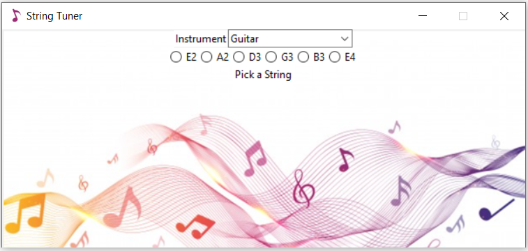

# a-plain-GUI-tuner-to-tune-musical-instruments
This Python tuner has a Tkinter GUI and can be used to tune your guitar and other musical instruments.
## Usage
* Choose your instrument at the top.
* Choose the string you wish to tune.
* Adjust your string until the display reads "Perfect!"

> **NOTE:** Be sure to allow microphone access.

You can add additional instrument support by adding new pairs of instrument - pitch values to the settings.py

## Dependencies
* Pitch: https://pypi.org/project/pitch/
* SciPy: https://pypi.org/project/scipy/
* Sound Device: https://pypi.org/project/sounddevice/

## Screenshot
